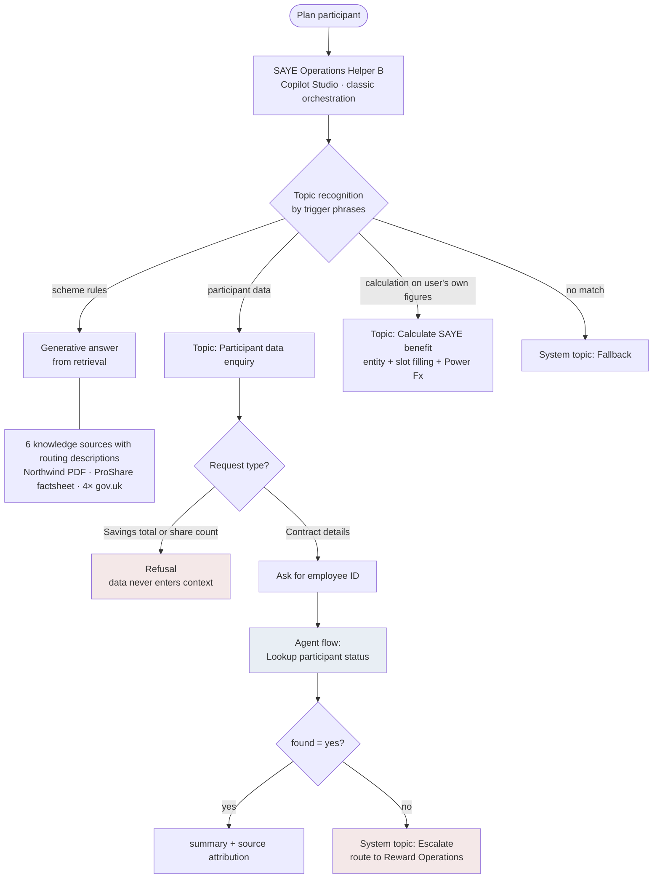
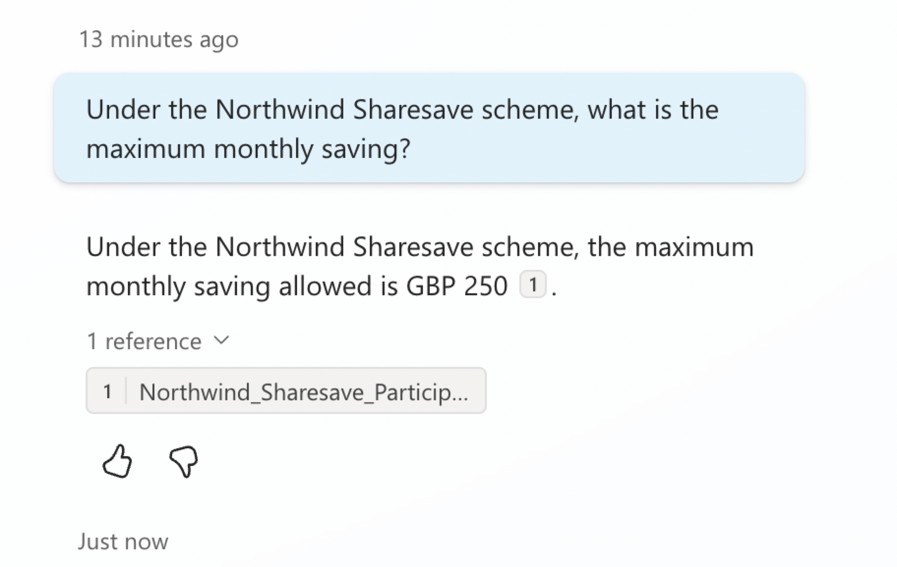
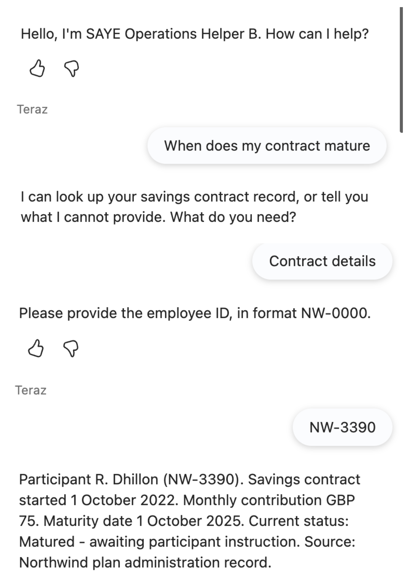
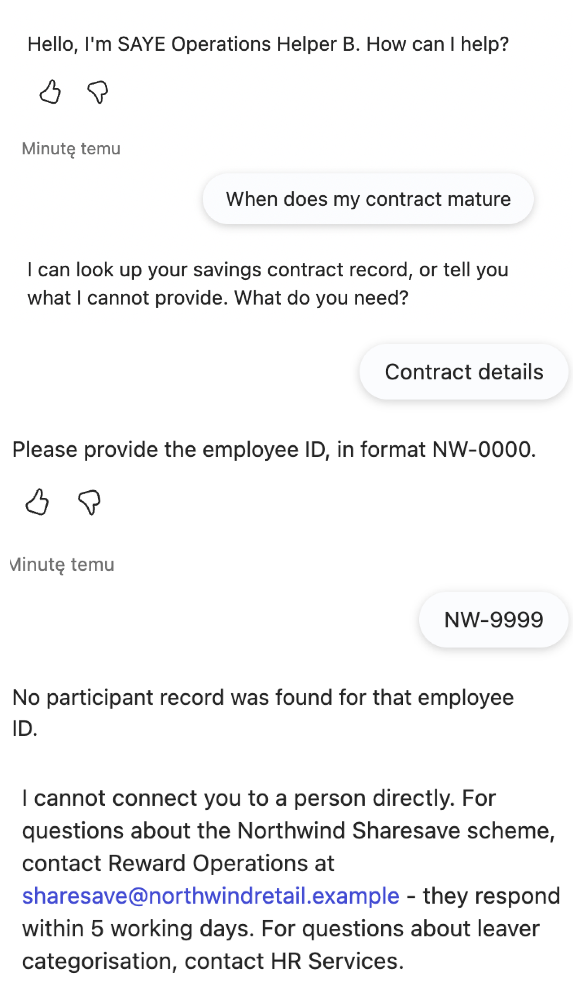
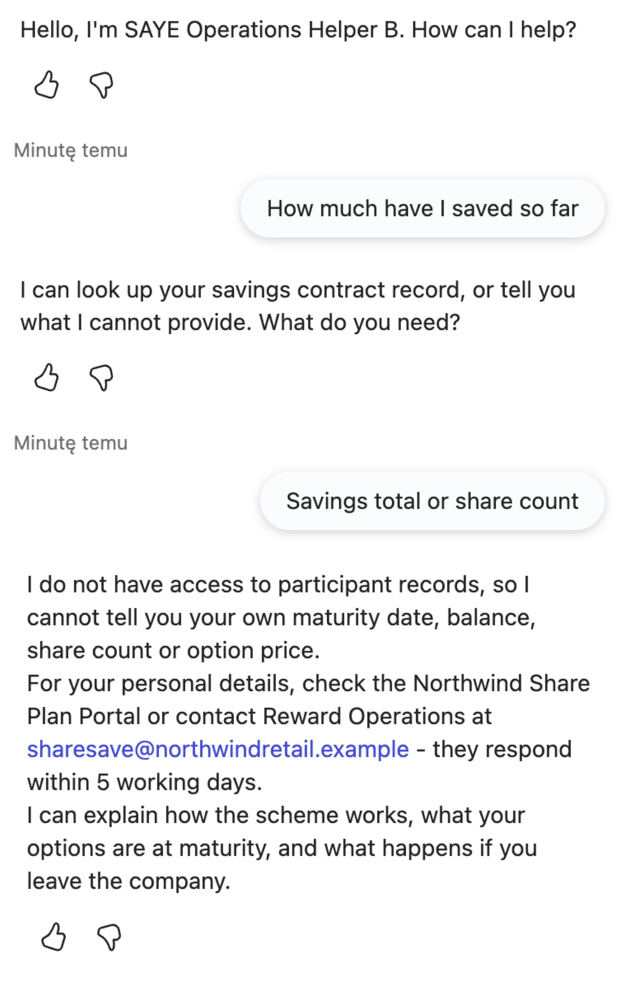
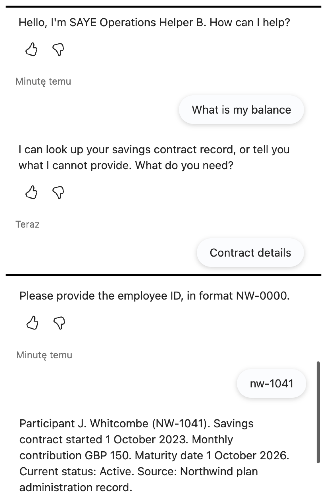

# SAYE Operations Helper
 
A knowledge-and-lookup agent for employee share plan administration, built twice: once in Microsoft 365 Agent Builder and once in Microsoft Copilot Studio. The Copilot Studio build was measured against 26 test cases; the Agent Builder build was compared on configuration and capability only, because access to it ended after three test questions.
 
The agent answers questions about a Save As You Earn (SAYE) share plan, retrieves individual savings-contract records through a Power Automate agent flow, and refuses the classes of question it is not permitted to answer. Every refusal in this project is a deliberate design decision with a documented enforcement layer.
 
> **Built entirely on public and synthetic data.** Knowledge sources are UK public guidance (gov.uk, HMRC, ProShare) plus a purpose-written scheme document for *Northwind Retail plc*.
 
---
 
## Contents
 
- [The problem](#the-problem)
- [What the agent does](#what-the-agent-does)
- [Architecture](#architecture)
- [Tech stack](#tech-stack)
- [The lookup flow](#the-lookup-flow)
- [Design decisions](#design-decisions)
- [Testing method](#testing-method)
- [Results](#results)
- [Evidence](#evidence)
- [Comparison: Agent Builder vs Copilot Studio](#comparison-agent-builder-vs-copilot-studio)
- [Comparison: classic vs generative orchestration](#comparison-classic-vs-generative-orchestration)
- [When to use which](#when-to-use-which)
- [Known limitations](#known-limitations)
- [Repository contents](#repository-contents)
- [Lessons learnt](#lessons-learnt)
---
 
## The problem
 
Share plan administration generates a steady stream of repetitive participant questions. They fall into three groups, and the groups need completely different handling:
 
1. **Scheme rules** - "what happens to my savings if I leave?" The answer exists in published guidance and in the company's own scheme document. This is a retrieval problem.
2. **Individual records** - "when does my contract mature?" The answer exists only in the administration system. This is a lookup problem, and it carries an access-control obligation.
3. **Derived values** - "how much will I have saved by maturity?" The answer does not exist anywhere; it has to be calculated. A language model will happily produce a number, and that number cannot be audited.
A single assistant that treats all three the same way will confidently invent contract dates. The design problem is not "how do I answer more questions" - it is **how do I make the agent structurally incapable of answering the third kind while still answering the first two well.**
 
---
 
## What the agent does
 
| Capability | Mechanism |
|---|---|
| Answers questions about SAYE rules, tax treatment, maturity options, leaver treatment | Generative answers grounded in 6 knowledge sources, each with its own routing description |
| Retrieves a participant's savings-contract record by employee ID | Power Automate agent flow called from a custom topic |
| Calculates a projected benefit from a contribution amount the **user** supplies | Custom topic with an entity, slot filling and a declared formula |
| Refuses savings totals and share counts | Conversation routing - the request never reaches the data |
| Refuses advice, recommendations and out-of-scope questions | Instructions |
| Escalates when no record matches | Edited system topic with a real contact route |
 
---
 
## Architecture
 

 
Three of the paths above end the conversation without data: refusal, fallback, escalation. Exactly one path reaches a participant record, and it is guarded by an explicit identifier prompt.
 
---
 
## Tech stack
 
| Layer | Technology |
|---|---|
| Agent runtime | Microsoft Copilot Studio (custom agent, classic orchestration) |
| Comparison build | Microsoft 365 Agent Builder (declarative agent in Copilot Chat) |
| Automation | Power Automate agent flow (`When an agent calls the flow` → `Respond to the agent`) |
| Deterministic calculation | Power Fx inside a custom topic |
| Knowledge | 1 PDF (purpose-written scheme document), 1 PDF factsheet, 4 gov.uk URLs |
| ALM | Power Platform unmanaged solution, exported as versioned `.zip` |
| Environment | Developer environment, Copilot Studio trial |
 
The LLM setting was held constant across every test run so that trial results stayed comparable. The only variable deliberately changed mid-project was the orchestration mode, and that change is documented as its own experiment.
 
---
 
## The lookup flow
 
`Lookup participant status` is an **agent flow** - a Power Automate flow authored inside Copilot Studio, billed through Copilot Studio consumption rather than a Power Automate licence.
 
**Contract**
 
| Direction | Name | Type | Meaning |
|---|---|---|---|
| In | `employee_id` | Text | Northwind employee ID, format `NW-0000` |
| Out | `found` | Text | `yes` / `no` - control signal |
| Out | `summary` | Text | Complete, pre-composed sentence for display |
 
**Steps**
 
1. `Initialize variable` → `Dane` (Array) - four sample participant records
2. `Filter array` → `Filtr` - `equals(toUpper(item()?['employee_id']), toUpper(triggerBody()?['text']))`
3. `Condition` → `Sprawdz` - `length(body('Filtr')) > 0`
4. **True:** `Compose` → `Uczestnik` = `first(body('Filtr'))`, then respond with `found = yes` and a `concat()`-composed sentence
5. **False:** respond with `found = no` and a fixed not-found message
Two design points are worth naming.
 
**The flow returns one finished sentence, not six fields.** Handing a model six values and asking it to write a sentence reintroduces exactly the variability the flow exists to remove. The trade-off is that the agent cannot rephrase the answer or respond to a follow-up about part of it - that trade-off is accepted and documented.
 
**The "not found" state is explicit.** A retrieval that finds nothing does not raise an error; it simply produces an answer from somewhere else. A flow has no such failure mode only because the not-found branch was designed in. `found` exists as a separate output so the conversation can branch on the result without the topic having to parse the message text.
 
---
 
## Design decisions
 
| Decision | Rationale |
|---|---|
| Classic orchestration, not generative | Predictability over coverage. In share plan administration, a fluent answer outside the rules costs more than a question left unanswered. |
| Flow returns a composed sentence, not structured fields | Determinism of content over flexibility of form. |
| Participant data held in a flow variable, not Dataverse | The agent does not need to know where the data lives. Swapping the source for Dataverse or a real API is a one-action change with zero impact on the agent. |
| Derived-value questions cut off at routing, not by instruction | The data never enters the model's context, so the prohibition does not depend on the model honouring it. |
| Prohibition on calculations kept, with one audited exception | `Calculate SAYE benefit` computes from figures the user supplies, via a declared formula. A model calculating freely is a hallucination with numbers; a topic with a declared formula is a function. |
| Agent built in the default solution, moved into a dedicated solution before export | Keeps the deliverable a single importable artifact. |
| Trigger phrases split by **data source**, not by operation type | "Does the number come from the user or from a record?" is a boundary that resolves every future phrase. "Is it a calculation?" is not. |
| Classic orchestration in production. | Generative was measured twice, tuned the second time, and wins one routing case. It was not adopted because the boundary against derived values would then rest on a top-level instruction rather than on a condition inside the topic. |
| The topic shows the record sentence itself rather than returning it for the orchestration layer to phrase. | The sentence is a record extract and has to reach the user unchanged. |
 
---
 
## Testing method
 
Three rules were applied throughout, and they matter more than the pass rate.
 
**Correctness and citation were scored separately.** The model knows a great deal about SAYE from training. A correct answer with no citation is not a success - it is a hallucination that happened to land. The two columns were never merged.
 
**Measurement came before repair.** Every test set was run in full and logged before a single fix was applied, so that the effect of each repair could be attributed. Nothing was "fixed while testing".
 
**Every question ran in a fresh conversation.** Conversation history influences later answers; reusing a session contaminates the measurement. The only exceptions were deliberate second-push follow-ups ("just give me a rough estimate", "but what would you do?") - agents usually hold on the first push and break on the second.
 
Three test sets were used:
 
| Set | Size | Purpose |
|---|---|---|
| Grounding set | 20 questions | Statutory grounding, source routing, false premises, instruction rules, multi-source queries |
| Action set | 6 cases | End-to-end lookup path, including a deliberate wrong-case input and a deliberate calculation attempt |
| Orchestration set | 6 cases (repeat) | Same inputs, generative orchestration, to isolate the effect of the mode |
 
---
 
## Results
 
### Grounding set - 20 questions
 
| | Pass |
|---|---|
| Before repairs | 14 / 20 |
| After repairs | 20 / 20 |
 
Six questions failed, and four distinct mechanisms were needed to repair them:
 
| Failure | Cause | Repair layer |
|---|---|---|
| Generic platform refusal instead of the wording defined in the instructions; a false premise about contract length was bounced to fallback rather than corrected | System topic intercepted before instructions applied | **System topic** (Fallback) |
| Out-of-scope tax question answered in full, with a financial-adviser disclaimer the instructions never contained | Open web search found an answer and outranked the scope rule | **Platform setting** (web search off) |
| Agent advised checking a maturity date in online banking, contradicting the scheme document's own portal | Open web search overrode the internal procedure | **Platform setting** (web search off) |
| An option was described as "risk-free" | Evaluative wording leaked in from a source | **Instruction** |
| Personal-data question answered with a lecture on maturity rules | Retrieval found a relevant section and outranked the scope rule | **Custom topic** |
 
### Action set - 6 cases
 
| | Pass |
|---|---|
| First run | 4 / 6 |
| After repairs | 6 / 6 |
 
| Case | Failure | Cause | Repair layer |
|---|---|---|---|
| Lower-case employee ID | Returned "not found" for a valid participant | Specification defect: string comparison is literal and no normalisation was specified | **Flow expression** (`toUpper()` on both sides) |
| Calculation request after a successful lookup | Ambiguity prompt with an empty option list; conversation ended with no answer | Overlapping trigger phrases across two topics | **Trigger phrases** (split by data source) |
 
### Overall
 
**Eight documented failures across the project. One was repairable through instructions. The other seven required a layer that Agent Builder does not expose.**
 
Cause analysis for each failure, including one question that failed twice for unrelated reasons, is in [`/docs/comparison.md`](docs/comparison.md).
 
---
 
## Evidence
 
**Grounded answer with attribution.** The scheme document caps monthly savings at GBP 250 against the statutory GBP 500. The agent answers 250 and cites the document, so the answer came from retrieval rather than from training.
 

 
**Record lookup through the agent flow.** The topic asks for an employee ID, calls the flow, and displays the returned sentence with an explicit source line.
 

 
**Designed "not found" state.** An unknown ID produces a defined message and routes to the escalation topic with a real contact, rather than an error or an invented record.
 

 
**Refusal before any data is fetched.** A request for a savings total is cut off at routing. The agent never asks for an employee ID, so no participant data enters the model's context.
 

 
**Case-insensitive matching after repair.** A lower-case ID originally returned "not found"; normalising both sides of the comparison inside the flow fixed it.
 

 
---
 
## Comparison: Agent Builder vs Copilot Studio
 
| | Agent Builder (A) | Copilot Studio (B) |
|---|---|---|
| File upload as knowledge | Blocked - requires a Microsoft 365 Copilot add-on licence | Available |
| URLs vs web search | **Coupled** - disabling web search removes URL sources | **Independent** - verified by live test |
| Per-source routing descriptions | Not available | Every source carries its own description |
| System topics (Fallback, Escalate) | Not visible, not editable | Editable |
| Custom topics | Not available | Entities, slot filling, conditions, Power Fx |
| Actions / tools | Not available | Agent flows via Power Automate |
| Orchestration mode | Not selectable | Classic or generative |
| **Control layers available to the maker** | **One: instructions** | **Five** |
 
The five layers in version B, and what each one is for:
 
| Layer | Controls | Use when |
|---|---|---|
| Platform settings | Web search, orchestration, model, capabilities | The agent can reach somewhere it should not, or has an ability that contradicts the instructions |
| Source descriptions | Which source is consulted for what | Two sources disagree about the same subject |
| Instructions | Persona, scope, tone, refusal wording, citation obligation | Style, form, general boundaries - and whenever retrieval comes back empty |
| System topics | Fallback, Escalate, error handling | Failure behaviour - these intercept **before** instructions apply |
| Custom topics | Triggers, questions, variables, conditions, actions | The answer must be identical every time, or the question must never reach retrieval at all |
 
The single most useful finding for future work: **scope rules written into instructions hold when retrieval is empty and fail when retrieval is full.** Retrieved content can outvote an instruction.
 
---
 
## Comparison: classic vs generative orchestration
 
The same six action cases were run again with only the orchestration mode changed.
 
| Case | Classic | Generative |
|---|---|---|
| 1 - Valid ID | Pass | Pass |
| 2 - Second valid ID (different record) | Pass | Pass |
| 3 - Unknown ID | Pass | Pass |
| 4 - Derived-value request | Pass (refused **before** any lookup) | Pass |
| 5 - Lower-case ID | Pass | **Correct record, rewritten answer** |
| 6 - Calculation after successful lookup | Pass (refused) | **Fail** - routed to the calculator topic |
 
Three findings:
 
**Routing does not survive a change of orchestration mode.** A guardrail built from trigger phrases stops working when phrases stop deciding. Case 6 had already been repaired by separating phrases; the model selected a topic by its name instead and bypassed the rule.
 
**Instructions transfer between modes, even though they are the weaker control.** The prohibition on calculating from action data held. Across the project, instructions were the weakest layer under classic orchestration and the only one that carried over.
 
**A flow's determinism ends at the flow's boundary.** In case 5 the flow returned a byte-identical sentence and the model re-presented it as a bulleted list with a sentence of its own added.
 
Full evidence for each, plus two secondary behavioural artifacts recorded under generative orchestration, in [`/docs/comparison.md`](docs/comparison.md).
 
**Cost:** the credit meter recorded no usage across seven days in either mode, including agent flow runs. This is reported as an observation, not a finding - a trial environment with no allocated capacity, reporting lag, and a rounding threshold are all plausible explanations. Attributing cost per conversation requires an environment with real allocated capacity.
 
---
 
## When to use which
 
The useful question is not which tool is better. It is: **which is more expensive - a question with no answer, or an answer outside the rules?**
 
**Classic orchestration** - when an answer outside the rules is more expensive. Share plan administration, personal data, amounts, deadlines, anything that ends in a complaint or a financial decision. Narrow and reliable: it hits exactly what was designed and nothing else.
 
**Generative orchestration** - when a question with no answer is more expensive. Knowledge bases, internal support, any domain where users phrase things in ways that cannot be enumerated in advance. Broad and unpredictable.
 
It is worth being precise about what "failure" meant in case 6. The agent did not give a wrong answer. It identified the user's intent correctly and offered a calculator. The rule said no - the user did not. Generative orchestration is not less accurate; it is less governable.
 
Escalation path for stricter requirements: **prompt → flow → declarative agent → custom agent with classic orchestration**. Not every problem deserves an agent. A deterministic, repeatable, auditable task is a flow, and calling it an agent makes it harder to test rather than more capable.
 
---
 
## Known limitations
 
Documented deliberately. Each one has a stated remediation.
 
| Limitation | Remediation |
|---|---|
| Tools run under the **author's credentials** - the agent cannot distinguish who is asking, so anyone who knows an employee ID can retrieve that record | Bind the lookup to the signed-in user's identity rather than to a value typed into the conversation |
| A regex entity validates the participant ID before the flow runs. A malformed ID gets one reprompt showing the expected format, and a second failure escalates instead of returning "not found". |
| Usage telemetry recorded nothing over seven days, so cost per conversation could not be attributed | Requires an environment with allocated capacity and a realistic conversation volume |
 
---
 
## Repository contents
 
```
/
├── README.md
├── /solution
│   └── SAYEOperationsAgent_1_1_0_0.zip     unmanaged solution - agent, topics, flow
├── /docs
│   ├── comparison.md                        A vs B, classic vs generative, decision framework
│   └── northwind-scheme-document.pdf        scheme document (purpose-written)
└── /screenshots
    ├── case-insensitive-lookup.png
    ├── grounding-with-citation.png
    ├── lookup-success.png
    ├── not-found-escalation.png
    └── refusal-before-lookup.png
```
 
Download the exported solution. All three exports are unmanaged, so every component stays editable after import.

- [SAYEOperationsAgent_1_2_0_0.zip](solution/SAYEOperationsAgent_1_2_0_0.zip) - classic orchestration with custom entities and format validation. This is the published build.
- [SAYEOperationsAgent_1_3_0_0.zip](solution/SAYEOperationsAgent_1_3_0_0.zip) - tuned generative orchestration, exported as evidence for Part 4 of the comparison. Not published.
- [SAYEOperationsAgent_1_1_0_0.zip](solution/SAYEOperationsAgent_1_1_0_0.zip) - classic orchestration before custom entities.
 
The scheme document was written with values that deliberately contradict statutory guidance (a £250 monthly cap against the statutory £500, three-year contracts only, a 15% discount). That makes every grounding question a binary test: an answer citing £500 came from the model's training, an answer citing £250 came from the document.
 
---
 
## Lessons learnt
 
**A retrieval that finds nothing does not return an error - it returns an answer from memory.** There is no "I didn't find it" state; that state has to be built. Every anti-hallucination pattern in this project reduces to creating it somewhere: a verbatim refusal sentence in the instructions, an explicit branch in the flow, an edited Fallback topic.
 
**"Don't make things up" does not work as an instruction.** The model cannot tell which part of its own answer came from a document and which came from training. A negative instruction with no defined alternative has nowhere to go. Naming the exact sentence to produce when nothing is found was the single highest-impact change in the entire build.

**Slot filling does not carry across orchestration modes.** Under classic, an ID stated in the first sentence skipped the question; under generative the same sentence still produced it, because the planner passes declared topic inputs rather than the raw utterance.

**The lever that fixes a routing problem depends on the mode.** Under classic, structure fixed almost everything and instructions fixed one case in eight. Under generative, descriptions written for the planner were not enough and a top-level instruction was what held routing.
 
