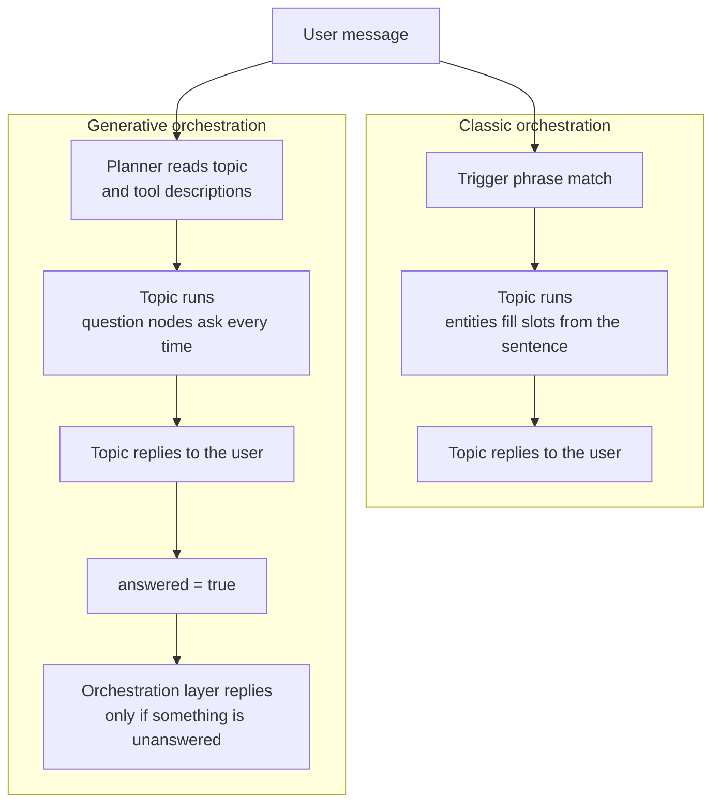

# Comparison: Agent Builder vs Copilot Studio

Two builds of the same agent. Version B was measured against the test sets described below; version A was compared on configuration and capability only, for reasons given in Part 5. A second experiment isolates the effect of orchestration mode in version B.

This document records what was measured, what it cost, and what the results imply for tool selection. It is not a feature list - feature lists are published by the vendor and go stale. The useful output of a comparison like this is a decision rule.

---

## Contents

- [Scope and method](#scope-and-method)
- [Part 1: Agent Builder vs Copilot Studio](#part-1-agent-builder-vs-copilot-studio)
- [Part 2: The failure log](#part-2-the-failure-log)
- [Part 3: Classic vs generative orchestration](#part-3-classic-vs-generative-orchestration)
- [Part 4: Orchestration mode, second run (tuned)](#part-4-orchestration-mode-second-run-tuned)
- [Part 5: Decision framework](#part-5-decision-framework)
- [Part 6: Limitations of this comparison](#part-6-limitations-of-this-comparison)

---

## Scope and method

**The task.** An assistant for Save As You Earn (SAYE) share plan administration. It must answer questions about scheme rules from published guidance and a company scheme document, retrieve individual savings-contract records, and refuse questions it is not permitted to answer - specifically advice, recommendations, and any figure that would have to be calculated rather than retrieved.

**The two builds.**

| | Version A | Version B |
|---|---|---|
| Tool | Microsoft 365 Agent Builder (declarative agent in Copilot Chat) | Microsoft Copilot Studio (custom agent) |
| Licence | Microsoft 365 Business Basic | Copilot Studio trial |
| Environment | Tenant default | Developer environment |
| Knowledge | Public URLs only | 6 sources: 2 PDFs + 4 URLs |

**What was held constant.** Both builds started from identical instructions and the same subject matter. Version B's instructions later changed during repairs and when the lookup action was added, and only version B holds the company scheme document, because version A's licence blocks file upload. Every question was asked in a fresh conversation. The only variable deliberately changed mid-project was orchestration mode in version B, and that change is reported separately in Part 3.

**Three measurement rules.**

*Correctness and citation were scored in separate columns.* The model knows a great deal about SAYE from training data. An answer that is correct but uncited is not a pass - it is a hallucination that happened to land on the right number. Merging the two columns would have hidden the single most important finding of the project.

*Measurement preceded repair.* Each test set was run in full and logged before any fix was applied. Nothing was adjusted mid-run.

*The scheme document was written to contradict the statute.* Northwind's fictional rules cap monthly savings at £250 against the statutory £500, permit three-year contracts only, and set a 15% discount. This turns every grounding question into a binary test: an answer citing £500 came from training, an answer citing £250 came from the document. Without this, "grounded" and "plausible" would have been indistinguishable.

**Test sets.**

All three sets were run on version B only.
| Set | Size | Purpose |
|---|---|---|
| Grounding | 20 questions | Statutory grounding, source routing, false premises, scope rules, multi-source queries, second-push resistance |
| Action | 6 cases | End-to-end lookup path, including a deliberate wrong-case input and a deliberate calculation attempt |
| Orchestration | 6 cases (repeat) | Same inputs under generative orchestration, to isolate the effect of the mode |

---

## Part 1: Agent Builder vs Copilot Studio

### Capability differences

| | Agent Builder (A) | Copilot Studio (B) |
|---|---|---|
| File upload as knowledge | Blocked - requires a Microsoft 365 Copilot add-on licence | Available |
| URLs vs web search | **Coupled** - disabling web search removes URL sources | **Independent** - verified by live test |
| Per-source routing descriptions | Not available | Every source carries its own description |
| System topics (Fallback, Escalate) | Not visible, not editable | Editable |
| Custom topics | Not available | Entities, slot filling, conditions, Power Fx |
| Actions / tools | Not available | Agent flows via Power Automate |
| Orchestration mode | Not selectable | Classic or generative |
| Export / versioning | Not available | Unmanaged solution, versioned `.zip` |
| **Control layers available to the maker** | **One: instructions** | **Five** |

### The coupling finding

The most consequential difference is not on the feature list. In version A, URL knowledge sources and open web search are the same capability. Turning off web search to stop the agent contradicting the company procedure also removes the four gov.uk sources the agent depends on.

This was verified by direct test rather than inferred from documentation. The consequence is a forced choice with no good option: either the agent can be overridden by whatever it finds online, or it loses its grounding entirely. In version B the two settings are independent, and the fix - web search off, URL sources retained - takes one click.

### The five control layers

Version B's advantage is not that it has more features. It is that failures land in different places, and each place needs a different kind of fix.

| Layer | Controls | Reach for it when |
|---|---|---|
| Platform settings | Web search, orchestration mode, model, capabilities | The agent can reach somewhere it should not, or has an ability that contradicts its instructions |
| Source descriptions | Which source is consulted for which subject | Two sources disagree and the wrong one is winning |
| Instructions | Persona, scope, tone, refusal wording, citation obligation | Style, form, general boundaries - and whenever retrieval comes back empty |
| System topics | Fallback, Escalate, error handling | Failure behaviour. These intercept **before** instructions apply |
| Custom topics | Triggers, questions, variables, conditions, actions | The answer must be identical every time, or the question must never reach retrieval at all |

The ordering matters. A system topic intercepts before instructions are consulted, which is why a carefully worded refusal sentence in the instructions produced a generic platform message instead - the instruction was never reached.

### The core finding on instructions

**Scope rules written into instructions hold when retrieval is empty and fail when retrieval is full.**

The instruction said the agent must not answer questions about an individual's own data. Asked "when does my contract mature?", the agent retrieved a genuinely relevant section on maturity dates and delivered a lecture instead of a refusal. Retrieved content outvoted the rule.

The same instruction held perfectly for questions where retrieval returned nothing. This is the mechanism behind most "the agent ignored my prompt" complaints, and it is not a prompting problem. It is a layer problem.

---

## Part 2: The failure log

### Grounding set

| | Pass |
|---|---|
| Before repairs | 14 / 20 |
| After repairs | 20 / 20 |

Six questions failed, and four distinct mechanisms were needed to repair them:

| Failure | Cause | Repair layer |
|---|---|---|
| Generic platform refusal instead of the wording defined in the instructions; a false premise about contract length was bounced to fallback rather than corrected | System topic intercepted before instructions applied | **System topic** (Fallback) |
| Out-of-scope tax question answered in full, with a financial-adviser disclaimer the instructions never contained | Open web search found an answer and outranked the scope rule | **Platform setting** (web search off) |
| Agent advised checking a maturity date in online banking, contradicting the scheme document's own portal | Open web search overrode the internal procedure | **Platform setting** (web search off) |
| An option was described as "risk-free" | Evaluative wording leaked in from a source | **Instruction** |
| Personal-data question answered with a lecture on maturity rules | Retrieval found a relevant section and outranked the scope rule | **Custom topic** |

One question is the instructive case, and it accounts for two rows above. It failed twice, for two unrelated reasons, and needed two different layers. Turning off web search removed the contradiction with the scheme document but not the scope breach - the question was still about an individual's own data. That part stopped only once a custom topic intercepted it before retrieval ran.

The single most useful diagnostic from this set: **a question can pass the obvious fix and still fail.** Re-running the full set after each repair, rather than re-testing only what broke, is what surfaced it.

### Action set

| | Pass |
|---|---|
| First run | 4 / 6 |
| After repairs | 6 / 6 |

| Failure | Cause | Repair layer |
|---|---|---|
| Lower-case employee ID returned "not found" for a valid participant | Specification defect: string comparison is literal, and no normalisation was specified | **Flow expression** - `toUpper()` on both sides |
| Calculation request after a successful lookup produced an ambiguity prompt with an empty option list; conversation ended with no answer | Overlapping trigger phrases across two topics | **Trigger phrases** - split by data source |

The lower-case failure belongs in a different category from the rest. The agent behaved correctly. The flow behaved correctly. Every component did exactly what it was told. The defect was in the specification, not the execution.

It was also **silent**: the user is told no record exists, which is indistinguishable from a genuinely unknown employee. A wrong capital letter and a non-existent colleague produce the same output. Silent failures are the expensive class, because nobody reports them.

### Aggregate

**Eight documented failures. One was repairable through instructions. Seven required a layer that version A does not expose.**

That ratio is the argument. It is a count, not an opinion, and it is what makes the choice between the two tools a design decision rather than a preference.

### Cost

The Copilot Studio credit meter recorded no usage across seven days of building and testing, in either orchestration mode, including every agent flow run.

This is reported as an observation, not a finding. A trial environment with no allocated capacity, reporting lag, and a rounding threshold are all plausible explanations, and none was ruled out. What can be said is narrower and still useful: **cost per conversation could not be attributed in this configuration.** Anyone planning a deployment needs an environment with real allocated capacity and a realistic conversation volume before treating any cost figure as reliable.

---

## Part 3: Classic vs generative orchestration

The six action cases were run again in version B with only the orchestration mode changed. Everything else - topics, flow, instructions, knowledge, model - was untouched.

| Case | Classic | Generative |
|---|---|---|
| 1 - Valid ID | Pass | Pass |
| 2 - Second valid ID, different record | Pass | Pass |
| 3 - Unknown ID | Pass | Pass |
| 4 - Derived-value request | Pass, refused **before** any lookup | Pass |
| 5 - Lower-case ID | Pass | Correct record, **rewritten answer** |
| 6 - Calculation after a successful lookup | Pass, refused | **Fail** - routed to the calculator topic |

### Finding 1: routing does not survive a change of orchestration mode

Case 6 had already been repaired by separating trigger phrases between two topics. Under generative orchestration it failed again, because trigger phrases no longer decide anything. The model selects a topic by its **name and description**.

The user asked how much they would have saved by maturity. A topic called `Calculate SAYE benefit` exists. The model matched the user's intent precisely and bypassed the rule completely.

This is the single most transferable result in the project. A guardrail built out of conversation routing is only a guardrail while routing is what decides.

### Finding 2: instructions transfer, even though they are the weaker control

The prohibition on calculating from action data held. The model had £150 monthly and a maturity date sitting in conversation context from case 5, and it asked the user for a monthly amount instead of using them.

Across the whole project, instructions were the weakest layer under classic orchestration and the only layer that carried over to generative. The two controls fail in opposite conditions, which is an argument for using both rather than choosing.

### Finding 3: a flow's determinism ends at the flow's boundary

In case 5 the flow returned the correct, byte-identical sentence. The model then re-presented it as a bulleted list with a sentence of its own added.

Under classic orchestration a message node displays the variable and nobody interprets it. Under generative orchestration the model receives the flow's output as **material for an answer**, not as the answer itself.

This defeats a deliberate design decision. The flow returns one pre-composed sentence rather than six separate fields precisely to deny the model material for paraphrase. That works only while the model never touches the output. In generative mode it receives the output either way, and returning fewer fields changes nothing.

### Secondary observations

Two behavioural artifacts were recorded under generative orchestration and not under classic: the topic returned to its opening question instead of ending, and slot filling looped when the user's reply contained no number.

### What "failure" meant in case 6

Worth stating precisely, because the framing matters more than the score. The agent did not give a wrong answer. It identified the user's intent correctly and offered a tool that would have answered it.

The rule said no. The user did not.

Generative orchestration is not less accurate. It is less governable.

---

## Part 4: Orchestration mode, second run (tuned)

The first run compared classic and generative orchestration on default
settings. Generative failed two cases: it routed a calculation request to the
calculator after a record lookup, and it reworded the flow's sentence instead
of passing it through. This second run re-tested generative after tuning,
to separate what the mode does from what its default configuration does.

### What was tuned

Four changes, all inside version B, with the model held constant:

1. Topic descriptions rewritten as instructions to the planner rather than
   notes to a human, stating when the topic applies and what its outputs mean.
2. A Boolean topic output, `answered`, set to true in the three branches that
   end with the topic having answered the user.
3. A top-level instruction telling the orchestration layer to check `answered`
   before replying, and not to repeat or reword an answer already shown.
4. The lookup tool's description rewritten to state what it returns and that
   it is called from one topic only.

### Results

| Case | Request | Result |
|---|---|---|
| G1 | Lookup for a known participant | Record sentence passed through verbatim, once. Fixes the first run's rewrite |
| G2 | Calculation requested after a lookup | Failed on descriptions alone: the calculator ran and returned a figure derived from a monthly amount the user supplied, contradicting the record. Passed only after the top-level instruction named both topics |
| G3 | Derived value requested with an ID in the sentence | Refused. The flow did not run |
| G4 | Direct question phrased outside the trigger phrases | Topic triggered and answered. Classic answered from knowledge instead |
| G5 | Unknown participant ID | Not found, escalated, no duplicate message |
| G6 | Hypothetical calculation | Calculator still reachable; the narrowed description did not block it |

Latency was comparable to classic, around three to four seconds measured by
stopwatch in the test pane of a developer environment. This is not a
production measurement.

### Slot filling does not survive the mode change

Under classic orchestration, a participant ID or enquiry type stated in the
first sentence filled the topic's questions and they were skipped. Under
generative orchestration the same sentences produced the same questions every
time.

The cause is structural rather than a defect. The planner does not hand the
topic the user's raw sentence; it passes the inputs the topic declares. Question
nodes inside the topic are not declared inputs, so there is nothing to
pre-fill them from. The entities still validate format once the question is
answered, so the guardrail survives while the convenience does not.

Carrying slot filling into generative orchestration means redeclaring each
question as a topic input with its own name, description and entity. That is a
rebuild of the topic, not a setting.

### The levers rank differently in each mode

In classic orchestration, instructions fixed one failure out of eight and
structure fixed the rest. In generative orchestration the order inverted:
descriptions written for the planner were not enough to hold routing, and the
top-level instruction was the lever that held it.

This is the strongest practical finding of the comparison. A team moving to
generative orchestration carries over its topics unchanged but not its
assumptions about where control lives.

### Decision

Classic orchestration stays in production, as version 1.2.0.0.

Generative wins one case that classic misses, G4, and that case is real: a
question phrased outside the trigger phrases. Its cost is that the boundary
"no values derived from a participant record" rests on an instruction, which
this document has already shown to be the weakest of the five layers. A
compliance boundary held by the weakest layer is a boundary that has to be
re-tested after every model change.

The cheaper repair runs the other way. G4 is fixed by adding a trigger phrase.
Predictability cannot be added to generative orchestration in one line.

Version 1.3.0.0 is the frozen generative build, kept as evidence rather than
as a release.

## Part 5: Decision framework

The useful question is not which tool is better.

> **Which is more expensive - a question with no answer, or an answer outside the rules?**

**Classic orchestration** when an answer outside the rules is more expensive. Share plan administration, personal data, amounts, deadlines - anything that ends in a complaint, a regulatory issue, or a financial decision made on bad information. Narrow and reliable: it hits exactly what was designed and nothing else.

The cost is real. This agent answers roughly six kinds of question well and returns a fallback message for everything else. A participant asking something nobody anticipated gets nothing, even when the answer sits in a source the agent holds.

**Generative orchestration** when a question with no answer is more expensive. Knowledge bases, internal support, onboarding - any domain where users phrase things in ways that cannot be enumerated in advance, and where a partially useful answer beats silence. Broad and unpredictable.

### Escalation ladder

Not every problem deserves an agent:

**prompt → flow → declarative agent → custom agent, classic orchestration → custom agent, generative orchestration**

Move up only when the layer below cannot hold the requirement. A deterministic, repeatable, auditable task is a flow; calling it an agent makes it harder to test rather than more capable. This project's lookup component is a case in point - the deterministic part is a flow, and only the conversation around it is an agent.

### Practical rules extracted

| Rule | Evidence |
|---|---|
| Match the control layer to the failure, rather than editing instructions repeatedly | 8 failures, 7 fixed outside instructions |
| Input control beats detection | A multiple-choice question cannot receive an out-of-domain value; an instruction correcting a false premise operates after the fact |
| Design the "not found" state explicitly | Retrieval that finds nothing does not error - it answers from training |
| Separate overlapping triggers by data source, not by operation type | "Does the number come from the user or from a record?" resolves every future phrase; "is it a calculation?" does not |
| Keep the data source behind the tool boundary | Swapping the flow's variable for Dataverse or a real API changes nothing in the agent |
| Scale the test set to the cost of being wrong | 20 cases was proportionate here; a film recommender would not need them |

---

## Part 6: Limitations of this comparison

Stated so that the results are read for what they are.

**Version A was not run against the test sets.** It answered three test questions before access to Copilot Chat on the tenant stopped, and Agent Builder is no longer accessible there. The version A column in Part 1 rests on configuration observed while building it and on those three answers, not on measured pass rates.

**One domain.** Share plan administration is unusually rule-bound and unusually intolerant of invention. A domain where partial answers are acceptable would likely reverse several conclusions, particularly the preference for classic orchestration.

**One test set, one author.** Twenty grounding questions and six action cases were written by the same person who built and scored the agent. No blind scoring, no second rater.

**Trial environment.** Version A ran under a licence that blocks file upload, so version A was never tested with the scheme document as a file source. Some of its limitations are licensing artifacts rather than product limits, and the document is explicit about which.

**Cost not measured.** See Part 2. The credit meter recorded nothing, and no explanation was ruled out.

**Product surface moves.** Agent flows, tool registration and the orchestration toggle all changed labelling and placement during the build. Findings about behaviour should outlast findings about where a setting lives.

**Deep reasoning was left off in both generative runs.** A build tuned along that axis was out of scope.

**Overlapping trigger phrases still produce a disambiguation prompt.** A question naming both a maturity date and a participant ID matches two topics, so under classic orchestration the agent asks the user which one they meant. Generative routes the same question without asking.

**A multi-word synonym did not fill the enquiry-type slot.** "how much have I saved so far" is a listed synonym and did not match, while the two-word "my contract" did. It costs one extra turn under classic orchestration and exposes no data.

**The custom no-entity message is not shown when the action is Escalate.** The escalation topic speaks instead, so the sentence written for that moment never reaches the user.
